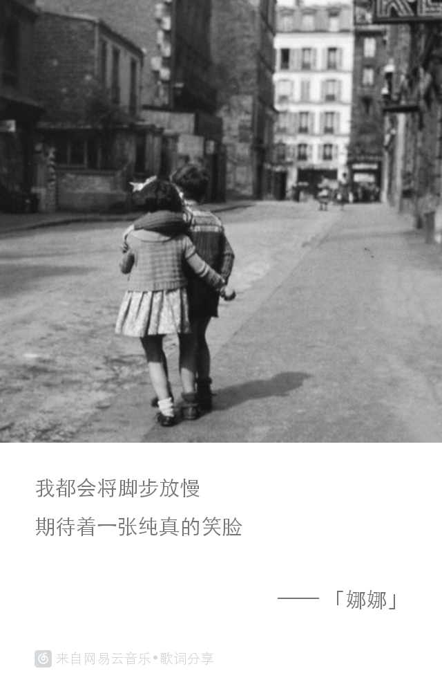
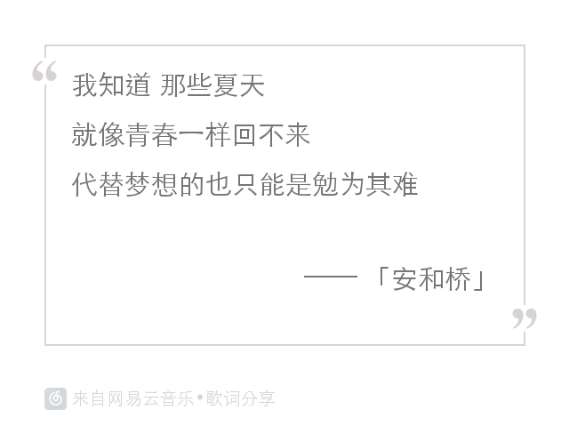
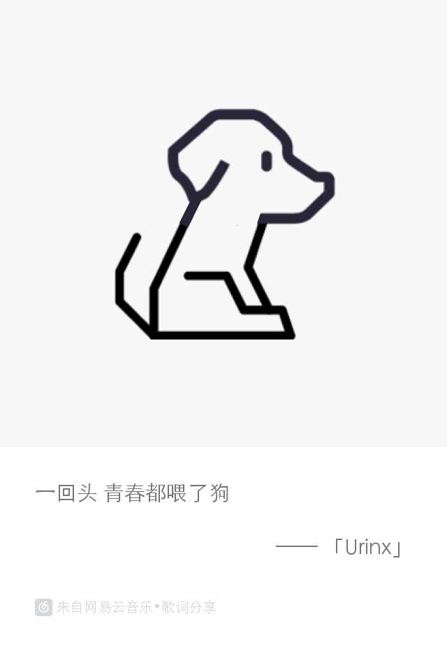

NeteaseLyric [](https://github.com/Urinx/NeteaseLyric) [](https://github.com/Urinx/NeteaseLyric/fork) 
----------------------

网易云音乐歌曲的歌词分享图片生成脚本。

一开始，[@lijiarui](https://github.com/lijiarui) 找了个生成网易云音乐歌词图片的脚本 [songzhi/Lrc2Img](https://github.com/songzhi/Lrc2Img) ，然而生成的歌词图片太丑，所以做了一些修改，加了一些其他的功能，使其贴近原版客户端的歌词分享图片，效果如下：

<div align=center>
  
<div>

## 使用说明

请先安装 `PIL` 等第三方包依赖，并提供字体文件放在 `res` 目录下，在代码中修改使用的字体。代码中默认使用的是 `STHeiti Light` 字体。

```
Usage: [--sid <song id> | --pid <playlist id>] -t <pic style> -r <random line>
	-i <your image> -w <some text> -n <name>

Options:
  -h, --help      show this help message and exit
  --sid=SID       song id
  --pid=PID       playlist id
  -t PIC_STYLE    1: has album image, 2: lyric only, 3: combine 1 & 2
  -r RANDOM_LINE  number of random lyric lines
  -i IMG_FILE     your own image
  -w TEXT         some text
  -n NAME         name
```

例1. 根据歌曲`id`生成该歌的歌词，图片样式为`1`，随机选取`2`行歌词：
```
python netease_lyric.py --sid 35476049 -t 1 -r 2
```
<div align=center>

</div>


例2. 根据歌单`id`生成歌单下所有歌曲的歌词图片，图片样式为`3`：
```
python netease_lyric.py --gid 138688333 -t 3
```


例3. 选取自己的图片和文字生成分享图片：
```
python netease_lyric.py -i 'path/to/img' -w '一回头 青春都喂了狗' -n 'Urinx'
```
<div align=center>

</div>
